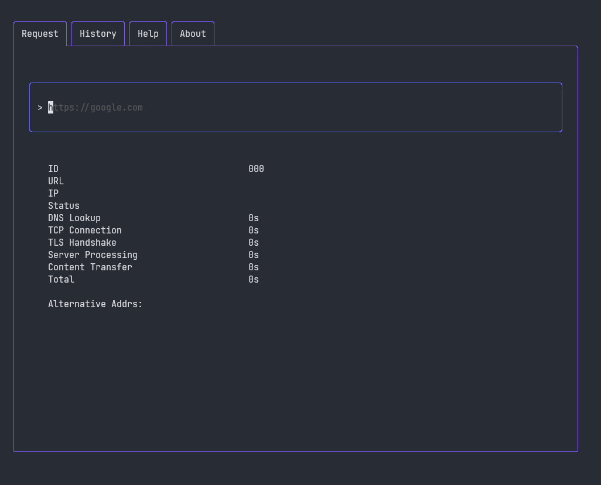

# responseTime 
A CLI Application to view the time taken for different phases of an outgoing HTTP request


### How to run:
- Download the latest executable from the [GitHub Release Section](https://github.com/nikita-t1/responseTime/releases)
- Open a Terminal and run the executable:
    ```shell 
    ./responseTime-amd64-linux 
    ```

### Build with:
[Bubbletea](https://github.com/charmbracelet/bubbletea)

### Background & Motivation
The Goal of this Project was to learn the [Go Programming Language](https://go.dev/)
